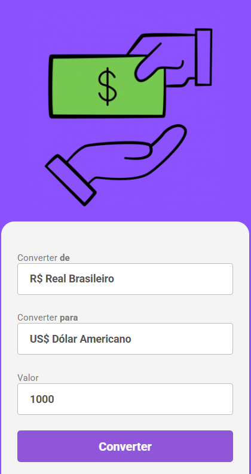
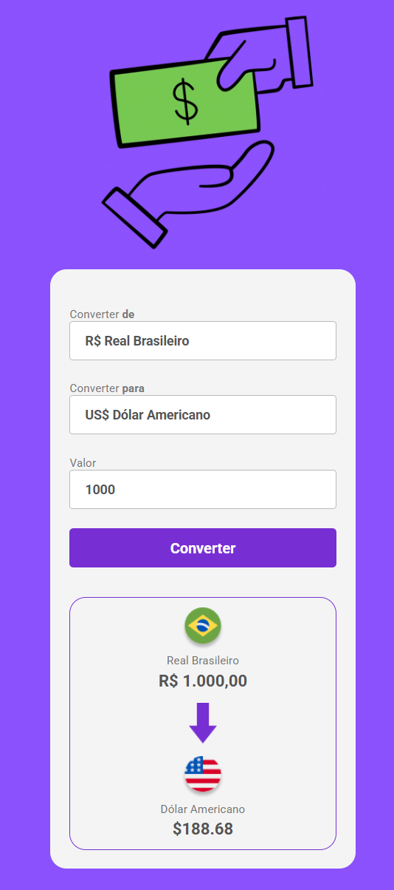

<h1 align="center">Conversor de Moedas</h1>

<p align="center">
  Aplicação web desenvolvida durante meus estudos de HTML, CSS e JavaScript no DevClub.
</p>

<p align="center">
  
</p>

## Sobre o projeto

O **Conversor de Moedas** é uma aplicação web que permite converter valores em Real Brasileiro para diferentes moedas internacionais.

O projeto foi desenvolvido durante meus estudos no **DevClub**, com o objetivo de praticar JavaScript, manipulação do DOM, eventos e formatação de valores monetários.

Atualmente, o conversor possui suporte para:

* Dólar Americano
* Euro
* Libra Esterlina

## Tecnologias

* HTML5
* CSS3
* JavaScript
* Intl.NumberFormat

## O que pratiquei neste projeto

* Estruturação de páginas com HTML
* Estilização com CSS
* Manipulação do DOM com JavaScript
* Captura de valores de inputs
* Manipulação de elementos com `querySelector`
* Manipulação de elementos com `getElementById`
* Criação e utilização de funções
* Estruturas condicionais
* Eventos com `addEventListener`
* Evento de `click`
* Evento de `change`
* Alteração dinâmica de textos
* Alteração dinâmica de imagens
* Formatação de moedas com `Intl.NumberFormat`
* Integração entre HTML, CSS e JavaScript

## Funcionalidades

* Conversão de Real Brasileiro para Dólar Americano
* Conversão de Real Brasileiro para Euro
* Conversão de Real Brasileiro para Libra Esterlina
* Seleção dinâmica da moeda desejada
* Atualização automática do nome da moeda
* Atualização automática da imagem da moeda
* Formatação correta dos valores monetários
* Conversão ao clicar no botão
* Atualização da conversão ao trocar a moeda

## Preview

### Conversor

<p align="center">
  
</p>

### Conversão

<p align="center">
  
</p>

## Como funciona

O usuário informa um valor em **Real Brasileiro (BRL)** e seleciona a moeda para a qual deseja realizar a conversão.

O JavaScript captura o valor informado e realiza o cálculo utilizando a cotação definida no projeto.

Depois da conversão, o resultado é formatado de acordo com a moeda escolhida:

* `BRL` para Real Brasileiro
* `USD` para Dólar Americano
* `EUR` para Euro
* `GBP` para Libra Esterlina

Ao trocar a moeda, o nome, a imagem e o valor convertido são atualizados automaticamente.

## Estrutura do projeto

```text id="w92zfa"
Projeto-conversor-de-moedas/
│
├── assets/
│   ├── dolar.png
│   ├── Euro.png
│   └── libra.png
├── captura1.png
├── captura2.png
├── index.html
├── script.js
├── style.css
└── README.md
```

## Como executar

Clone o repositório:

```bash id="8hpq5a"
git clone https://github.com/lemueltimotio/conversor-de-moedas.git
```

Depois abra o arquivo `index.html` no navegador.

## Projeto online

Após publicar o projeto utilizando o **GitHub Pages**, ele poderá ser acessado diretamente pelo navegador.

```text id="201jt6"
https://lemueltimotio.github.io/conversor-de-moedas/
```

## Autor

Desenvolvido por **Lemuel Juan Dias Timotio** durante meus estudos de desenvolvimento web no DevClub.
